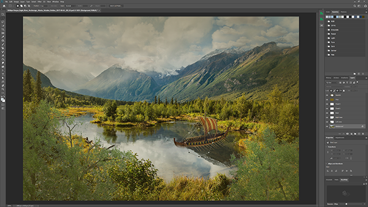
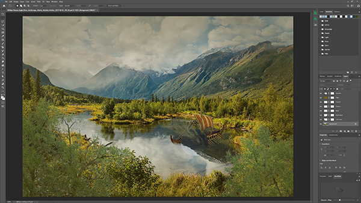
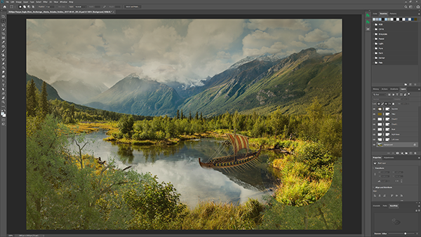
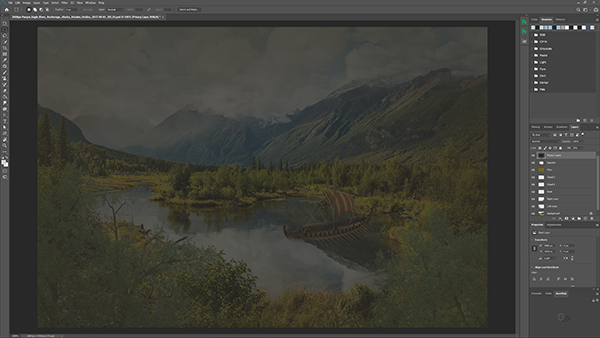
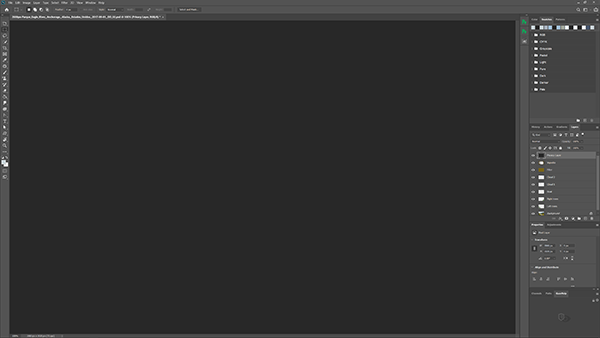
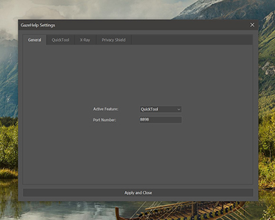
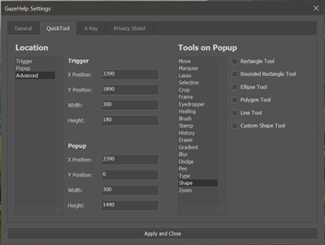
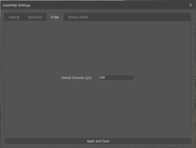
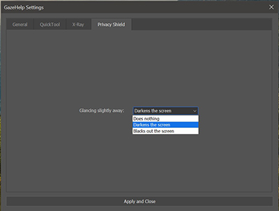

# GazeHelp
An Adobe PhotoShop CEP plugin controlled by eye tracking, implementing three
gaze-assisting features:

1. QuickTool, a gaze-triggered popup that allows the user to select their next tool with gaze
2. X-Ray, providing the user a circular window a selected underlying layer the position of which is selected with the eyes
3. Privacy Shield, dimming and blocking the current art board from view when looking away from the screen

This project was completed for the HCI Project (INFO90008) at the University of Melbourne.

# How to Use
1. You'll need Adobe PhotoShop, a Tobii eye tracker (tested on a Tobii 4C), and Windows to run this plugin.
2. Install the GazeHelpServer [here](https://github.com/rlewien3/GazeHelpServer) to interact with your Tobii eyetracker.
3. Place this entire contents in: C:&#92;Program Files&#92;Common Files&#92;Adobe&#92;CEP&#92;extensions&#92;GazeHelp\
4. Open up the extension in PhotoShop under Window>Extensions>GazeHelp and you're good to go!

If you run installation issues, go to:
1. regedit > HKEY_CURRENT_USER/Software/Adobe/CSXS.9
2. Add a new entry "PlayerDebugMode" of type "string" with the value of "1"

# Screenshots

## QuickTool
\
QuickTool trigger panel, waiting in the bottom right corner to be looked at.\
\
\
Pressing the space bar while looking at the trigger opens this popup, which can be selected by releasing the space bar.\
\
\
The popup's location, size and tools can all be changed in the settings panel.

## X-Ray
\
Pressing and holding the button on the plugin creates a circular outline that follows where the user is looking.\
\
\
Releasing the button converts the outline to a circular mask cutout, exposing the selected layer.\
\
\
The size of the circle can be changed with the panel's diameter slider.\
\

## Privacy Shield
\
Glancing slightly away from the screen temporarily dims the image, until the user looks back.\
\
\
Looking entirely away from the screen temporarily covers up the image, until the user looks back.

## Settings Page
The following settings can be quickly changed in the panel's settings popup.

\
\
\
\
\
\

